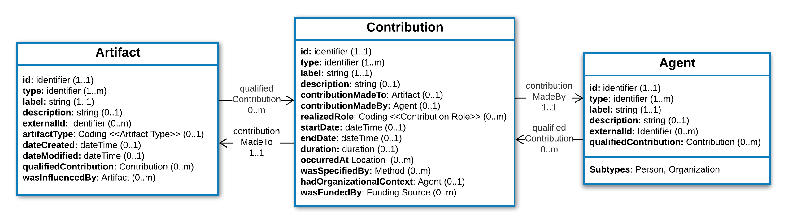

.. _information-model:

Information Model
!!!!!!!!!!!!!!!!!

An Information Model (IM) provides as an informal, language and format agnostic representation of a modeling domain.  Information models provide a unifying conceptual model that conveys the semantics and scope of the domain, and guide concrete implementations in any number of formal schema languages. They  abstract over protocol and implementation details to focus on defining the characteristics of and relationships between domain concepts. The Unified Modeling Language (UML) diagram in **Figure 2** presents a high-level view of the Contributor Attribution Information Model.  

   **Figure 2: The CAM Information Model** The UML diagram shows attributes of each core class, relationships between them, and default cardinality constraints for data collection. Specific implementations can select from among these attributes, refine default cardinality constraints, and extend the model with type specializations and additional attributes to suit their domain and use case. Italic font of the Agent class indicates it is an abstract class that is intantiated only through its subtypes.

Subsequent pages in the Information Model specification are indexed below and navigable from the menu on the left, and provide detailed descriptions, structural specifications, and implementation guidance for each :ref:`Class <class>`, :ref:`Data Type <data-type>`, and :ref:`Value Set <value-set>`.  The CAM specification will also provide a formal :ref:`JSON schema <json-schema>` specification of the Information Model, as one of many possible concrete representatons of the data model.

.. _terms-typo-conventions:

.. important:: **Terminological and Typographic Conventions in this Documentation**

          * We use the term '**class**' to refer to core modeling types in the specification. In other specifications this concept may be referred to as a 'type', 'resource', or 'object'. When referred to as modeling constructs in the text, class names are Capitalized (e.g. ‘Person’, ‘Contribution’)
          * We use the term '**attribute**' to refer to named characteristics or relationships of classes. In other specifications this concept may be referred to as a ' slot', 'element', 'field', or 'property'. When referred to as modeling constructs in the text, attribute names are italicized and camelCased (e.g. ‘startDate’, ‘qualifiedContribution’)
          * We use the term '**data type**' to refer to more fundamental and general-purpose categories of data objects. These may include ‘simple’ data types (e.g. ‘string’, ‘integer’, ‘identifier’) that are represented as a single literal value, or ‘complex’ data types that are represented as objects with their own attributes (e.g.  ‘coding’). 
          * We use the term '**instance**' or '**object**' to refer to instantiations of classes in the data. References to a specific instance in descriptions of data examples are written as ``inline literals`` in red Courier font.
          * We use the term ‘**value set**’ to refer to named collections of codes that are bound to specific attributes. These are Capitalized in the text and include ‘Value Set’ in their name (e.g. ‘Contribution Role Value Set’)
          * The capitalized keywords "MUST", "MUST NOT", "SHOULD", "SHOULD NOT", "MAY", “RECOMMENDED”, and “REQUIRED”  in this document are to be interpreted as described in `RFC 2119 <https://www.ietf.org/rfc/rfc2119.txt>`_. 

.. toctree::
   :maxdepth: 2
   :caption: Index
   
   classes/index
   data_types
   value_sets