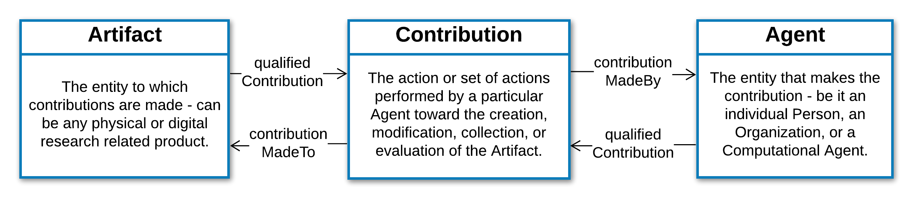

Introduction
!!!!!!!!!!!!

Background and Motivation
@@@@@@@@@@@@@@@@@@@@@@@@@
Open science, team science, and a drive to understand meaningful outcomes have transformed research at all levels. Scholars and researchers contribute to research and scholarship in ways that can no longer be recognized via traditional means of publication counts and grant dollars received. Efforts to rigorously attribute, evaluate, and reward such contributions must be built on a data models that facilitate nuanced and computable characterization of research products, and the context in which they are developed and used. Unfortunately, little infrastructure exists to identify, aggregate, present, and understand the impact of non-traditional contributions (e.g. curation or data analysis). Challenges to recognizing these contributions are technical as well as cultural, and addressing them requires an approach that assimilates various perspectives for investigators and organizations, alike.

Framework Components
@@@@@@@@@@@@@@@@@@@@
Here we present a simple yet powerful ontology-based Contributor Attribution Model (CAM) framework, developed as part of the `CD2H Architecting Attribution <https://github.com/data2health/architecting_attribution>`_ project, that aims to address these challenges. It will be comprised of the following components:

1. An :ref:`information-model` that provides an informal, format-agnostic specification of the domain.
2. A :ref:`JSON-LD schema <json-schema>` specification of the Information Model to support data creation and validation. This includes an Linked Data (LD)-context document with mappings between schema elements and ontology terms, enabling the creation of RDF/Linked Data.
3. A :ref:`Tabular File Format <tsv-format>` specification of the Information Model that provides a low-tech, curator friendly tool to support contribution metadata collection in diverse settings/contexts. 
4.  :ref:`Ontologies <ontologies>` that provide a semantic foundation for the data model. These will support a complete ontological mapping of schema elements (as defined in the LD-context), provide terms for value sets, and enable ontology-based support for operating on contribution metadata.
5. A :ref:`Code Library and Services <code-and-services>` that can support interconversion of data formats (e.g. tabular to RDF), identifier mappings, and terminology support for building valu sets.
6. An :ref:`Implementation Guide <implementation-guide>` to support creation of CAM-compliant data in different formats and contexts.

Scope and Applications
@@@@@@@@@@@@@@@@@@@@@@
The scope of the Contributor Attribution Model is limited to representing the nature of an agent's contribution to a research artifact - specifically when, where, how, and in what capacity the contribution was made. It achieves this with a simple and concise model composed of three core classes: an **Artifact**, an **Agent** who contributes to it, and a **Contribution** object that sits between them (**Figure 1**). This simple structure is intended to be used as a *module* in the context of a larger data model that more fully captures the semantics of a given domain or use case.  Implementations can refine or extend the model in different ways to suit their specific domain and use case, as described in more detail in the :ref:`implementation-guide`. 

   **Figure 1**: Core classes and relationships in the Contributor Attribution Model

Application areas for CAM-based modules may include **publishers** capturing author contributions to papers, **curated knoweldgebases** collecting information on curators contributions to annotation records as they mature through the system, **research profiling applications** describing contributions to diverse types of scholarly outputs, **research data management platforms** detailing contributions to data objects they manage, **data repositories** capturing contributions to cataloged data sets, and **software development platforms** capturing contributions to code and other software artifacts. In these contexts, the model can support the collection, provision, and exchange of detailed contribution metadata, display of this metadata to system users, and the ability to perform precise contribution-related queries and computational analyses.

A Simple Example
@@@@@@@@@@@@@@

Below is a simple JSON example of hwo the CAM woudl represent a __ contribution to a publication made by an agent as a member of the __ organization.  illustrating how the model would represent . . .

Additional and more complex examples can be found in the :ref:`implementation-guide`.
